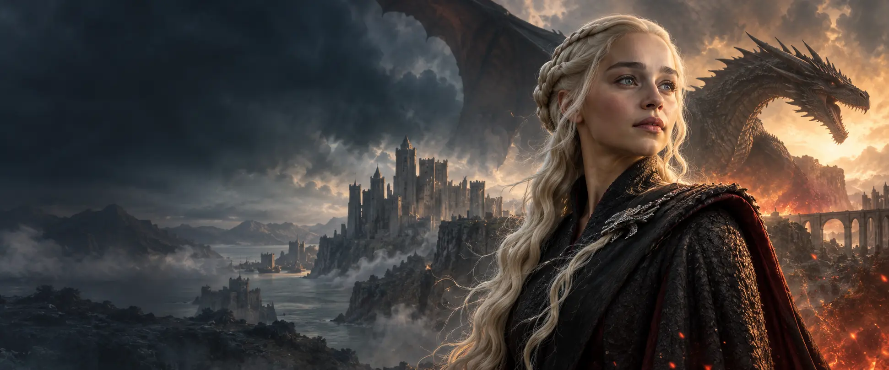

# 权力的游戏关系图

> 伊戈和伊耿二世，是同一个人吗？雷妮拉的血脉怎样走到丹妮莉丝？瓦格哈尔到底跟过谁？
>
> 打开这张图，把三部剧的家族、巨龙、战役和地图连起来看。

**在线入口**：GitHub Pages 启用后，从仓库主页的 Pages 链接打开互动图。仓库中的 [`index.html`](./index.html) 是源文件，下载后在浏览器打开也可探索。

## 从哪条线开始？

**沿血脉**：从《龙之家族》的继承纷争，走到《七王国的骑士》的邓克与伊戈，再走到《权力的游戏》的铁王座与长夜。图中明确区分伊耿二世、雷妮拉之子伊耿三世，以及长大后成为伊耿五世的伊戈。

**沿地图**：点北境、王领、河间地或狭海彼岸，相关人物与巨龙会亮起来。地图表达地区相对方位，不是精确 GIS 战场坐标。

**沿剧情**：点击六条情节主线或十场重要战役与转折，依次看起因、交锋与结果。每一步都会切换相关人物与关系线。

**沿关系**：点一位人物看亲属、盟友、敌人和龙；点“两人关系路径”，再选两个节点，看他们如何通过已收录的关系相连。勾选线型、只看高亮，可把复杂的线网理清。

## 图谱里有什么？

| 内容 | 数量与方式 |
| --- | --- |
| 人物 | 125 位，含改变战局或推动剧情的配角 |
| 巨龙 | 15 条，连接剧中骑手 |
| 关系 | 218 条，按亲子、兄妹、婚姻、同盟、敌对、师徒、隔代血脉及骑手分类 |
| 探索入口 | 6 条情节主线、10 场战役或转折、可点击的地区与地点 |

每个节点都有图像与名称、别称、所属作品和关联地区。人物照片从 TVmaze 的公开剧集资料在线加载；无法匹配或离线时显示明确标注的原创矢量插画。巨龙使用矢量插画。需要注意：**“隔代血脉”是一条概括线，不等于直接父子关系**；地图中的人物归属兼顾籍贯和主要活动地。

## 使用与说明

本项目是无需构建的单页 HTML。直接打开 [`index.html`](./index.html) 即可使用；联网可尝试加载演员照片，离线仍可浏览文字、插画、地图、剧情和关系网。页面包含剧透。

剧情与角色可从 [HBO《龙之家族》](https://www.hbo.com/house-of-the-dragon)、[HBO《权力的游戏》](https://www.hbo.com/game-of-thrones) 和 [Warner Bros. Discovery《七王国的骑士》](https://press.wbd.com/us/media-release/hbo-original-drama-series-knight-seven-kingdoms-debuts-january-18) 核对；照片来源说明见 [TVmaze API](https://www.tvmaze.com/api)。本项目为非官方剧迷整理，与 HBO、Warner Bros. Discovery 或 TVmaze 无隶属关系。角色及演员照片的权利归各自权利人；公开再利用照片前请确认授权。

**一句话玩法：**先点“邓克与伊戈”，再点“王朝血脉”。你会发现同叫伊耿的人，相隔的不止一个王朝。
